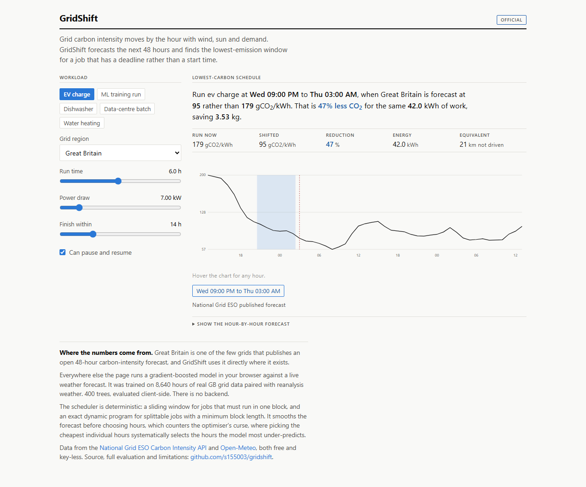
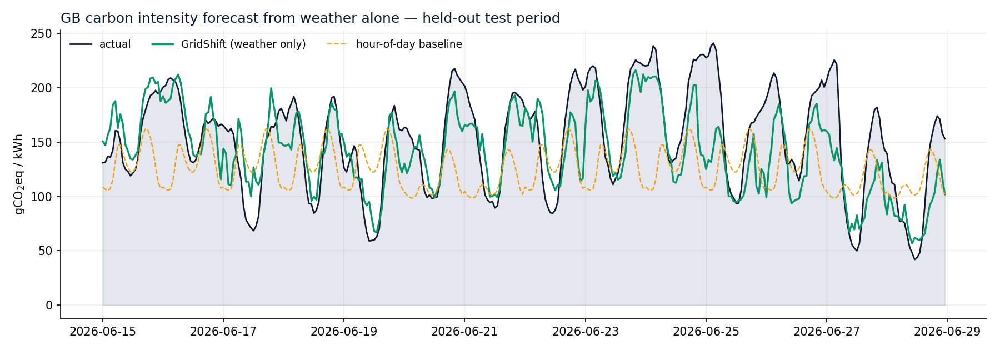
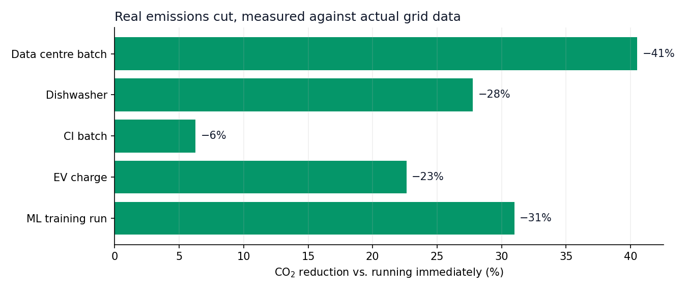
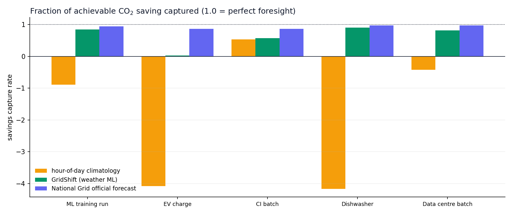
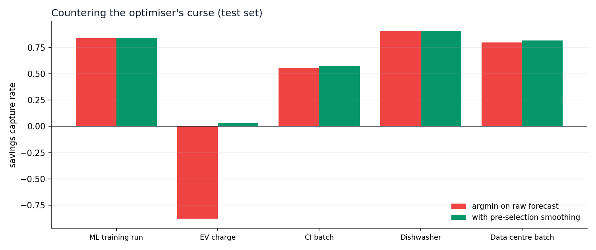

# GridShift

**Run it when the grid is clean.**

Electricity is not equally dirty all day. On Great Britain's grid over the last
twelve months, carbon intensity ranged from **20 to 282 gCO₂/kWh**, a **13.8×
swing** between the cleanest and dirtiest hour of the year. The same
kilowatt-hour can cost you fourteen times as much CO₂ depending on *when* you
draw it.

An enormous share of electricity demand does not care when it runs. An EV
charging overnight, a model training job due by morning, a dishwasher, a batch
queue, a water heater. All of them have a deadline rather than a start time.
Today essentially all of that demand runs whenever it was switched on.

GridShift forecasts the carbon-intensity curve from weather, then moves flexible
workloads into the cleanest hours inside their deadline. Same work, same
deadline, **6 to 40% less CO₂**, no new hardware.

**[Live dashboard](https://s155003.github.io/gridshift/)**, which runs a trained
model in your browser against live weather with no backend.



Regenerate that screenshot, and check the deployed page for runtime errors,
with `node shoot.mjs` inside `web/`. Grep and unit tests cannot catch a React
error or a layout defect, so this drives a real browser at the live URL.



---

## The problem this actually solves

Carbon-aware scheduling is a known idea. What has held it back is a data
availability problem:

> Only a handful of grids on Earth publish an open, real-time carbon-intensity
> forecast. Great Britain does. Almost nowhere else does, including California,
> Texas, India and Australia. Without a forecast there is nothing to schedule
> against.

GridShift's core idea is that you do not need a carbon API. You need weather.
Grid carbon intensity is largely a function of things weather already tells you:
how hard the wind is blowing across the turbine fleet, how much sun is hitting
the panels, and how cold it is, which drives demand. So:

1. **Learn** the mapping *weather to carbon intensity* where ground truth exists (GB).
2. **Transfer** it anywhere on Earth using free global weather forecasts.

That is what makes this more than a dashboard over an existing API.

---

## Results

Trained on **8,640 hours** of real GB grid data (Aug 2025 to Aug 2026) paired
with real reanalysis weather. Split **chronologically** into train (70%),
validation (15%) and test (15%). Model parameters were fit on train, the
scheduling policy was chosen on validation, and **every number below comes from
the test set, touched once.**

### Forecast accuracy on the test set

| Forecaster | MAE | RMSE | R² |
|---|---:|---:|---:|
| Persistence (train mean) | 45.13 | 52.82 | −0.01 |
| **Hour-of-day climatology**, the baseline that matters | 43.58 | 53.03 | −0.02 |
| Month × hour climatology | 44.39 | 52.51 | 0.00 |
| **GridShift (weather ML)** | **30.81** | **37.44** | **0.49** |
| National Grid ESO official forecast | 9.56 | 12.61 | 0.94 |

**29.3% lower error than the hour-of-day baseline.** That baseline is the honest
bar, because anyone can tell you the grid is cleaner at 3am. Beating it means
the model is genuinely reading the *weather* rather than the clock.

The official National Grid forecast is **3.2× more accurate than ours**, and it
should be. It sees generator-level dispatch schedules and interconnector plans
that no public weather API exposes. We report it as the ceiling to measure
against. Where it exists, GridShift uses it. The point of the model is
everywhere it does not.

### What the model learned

Permutation importance, measured as MAE increase when a feature is shuffled:

| Feature | Δ MAE |
|---|---:|
| `renew_proxy` (wind and solar availability) | +6.56 |
| `hour_sin` (time of day) | +3.30 |
| `dunkelflaute` (calm and dark, the classic high-carbon event) | +3.24 |
| `wind_speed_mean` | +1.64 |
| `dow_sin` (weekday versus weekend demand) | +1.31 |

The top signals are physical rather than calendrical, which is exactly what has
to be true for the transfer idea to work.

### Emissions actually saved

Rolling every job archetype across the whole test period and measuring the
schedule against **what the grid really did**:

| Workload | CO₂ reduction vs. running immediately |
|---|---:|
| Data-centre batch (8h, splittable, 48h slack) | **−40.5%** |
| ML training run (4h GPU, by tomorrow) | **−31.0%** |
| Dishwasher (2h, by morning) | **−27.8%** |
| EV charge (6h, splittable, overnight) | **−22.6%** |
| CI batch (2h, within the workday) | **−6.3%** |



The pattern is the honest one: **savings scale with slack.** A job with 48 hours
of deadline room can find a genuinely clean window. A 2-hour job that must
finish inside the workday mostly cannot, and GridShift reports 6% rather than
40%.

To see how that plays out on today's grid rather than on the test-period
average, run `python scripts/explain_today.py`.

---

## The metric we optimise is not accuracy

RMSE is the wrong objective here, and building around it would have produced a
worse product.

A scheduler does not need to know that 3am will be 91 gCO₂/kWh. It needs to know
that **3am is cleaner than 6pm**. A forecast biased by a constant 40 gCO₂/kWh
everywhere scores terribly on MAE and schedules perfectly, because scheduling
depends only on the **ranking** of hours.

So GridShift is evaluated on **savings capture rate**:

> Of the CO₂ that a perfect-foresight oracle could have saved by moving this job,
> what fraction did we actually capture?

`1.0` means as good as knowing the future. `0.0` means no better than running
immediately. **Negative means actively made things worse.**

| Workload | Hour-of-day | **GridShift** | Official forecast |
|---|---:|---:|---:|
| ML training run | −0.89 | **0.84** | 0.94 |
| Dishwasher | −4.16 | **0.91** | 0.97 |
| Data-centre batch | −0.42 | **0.82** | 0.97 |
| CI batch | 0.53 | **0.57** | 0.87 |
| EV charge | −4.09 | **0.03** | 0.86 |



Note how badly the clock-only baseline scores. On several archetypes "just run
it at night" lands well below zero, meaning it is worse than not scheduling at
all, because it confidently sends every flexible load to the same hours
regardless of whether the wind is blowing.

---

## The bug we found, and the fix

The first honest evaluation produced an uncomfortable result:

```
EV charge (6h, splittable, overnight)     capture rate: -0.44
```

**Negative.** Following GridShift's advice emitted *more* CO₂ than plugging in
immediately. That is a product that actively harms the thing it claims to help.

The cause was statistical rather than a coding error. It is the **optimiser's
curse**:

- A job that must run **contiguously** averages the forecast over a whole
  window, so independent errors partly cancel.
- A **splittable** job takes an `argmin` over individual hours, and `argmin`
  over noisy estimates preferentially selects **the hours where the model most
  under-predicts.** Selection systematically amplifies exactly the errors you
  would most like to avoid.

We hypothesised the fix was **pessimism**, selecting on a predicted upper
quantile so that uncertain hours are penalised rather than rewarded, and swept
quantile regression at 0.5, 0.6, 0.7, 0.8 and 0.9 against smoothing windows of
1, 3 and 5 hours.

**Our hypothesis was wrong.** Pessimism barely helped. What worked was
**low-pass filtering the forecast before selection**, averaging neighbouring
hours so that single-hour noise spikes cannot win the `argmin` on their own.
Chosen on the validation set, then measured once on test:

| Workload | argmin on raw forecast | with 3h pre-selection smoothing |
|---|---:|---:|
| **EV charge** | **−0.88** | **+0.03** |
| Data-centre batch | 0.80 | 0.82 |
| CI batch | 0.56 | 0.57 |
| ML training | 0.838 | 0.841 |
| Dishwasher | 0.906 | 0.908 |



Selection and scoring deliberately use **different signals**. Hours are chosen
using the smoothed curve, but every emissions figure reported back is recomputed
from the raw forecast. Smoothing is a decision aid rather than a change to our
best estimate.

We are leaving the EV number at **0.03** rather than tuning until it looks good.
It is the weakest case in the product. A 6-hour job inside a 14-hour window is
mostly constrained, so there is little to capture and our forecast is not sharp
enough to capture it. The official feed gets 0.86 on the identical windows.
Where a real carbon API exists, **use it**, which is what GridShift does.

---

## How AI is used

Three distinct layers, and the boundaries between them are the design.

**1. Gradient-boosted forecasting model**, the core. 400 trees, 31 features,
mapping weather and calendar to gCO₂/kWh. Deliberately
**non-autoregressive**, because it never sees a past carbon-intensity value. A
model that needs yesterday's intensity to predict tomorrow's cannot be
transferred to a grid that publishes none. Every feature comes from a public
weather forecast and a calendar.

Domain physics is built into the features rather than left for the trees to
rediscover. There is a real **turbine power curve** (cubic ramp from 3.5 m/s
cut-in to 12.5 m/s rated, flat to 25 m/s, then zero as turbines feather in a
storm), asymmetric heating and cooling degree-days, and a `dunkelflaute`
interaction term for the calm, dark conditions that force gas onto the margin.

**2. Claude, via tool use, for intent.** The LLM parses *"train my model for
about four hours, needs to be done before I wake up, it's a 350W GPU"* into a
validated `JobSpec` via a strict-schema tool call. It infers what a human would:
that an EV charger is interruptible and a dishwasher cycle is not, that a "rack
GPU job" draws about 0.7 kW, that "before I wake up" means roughly 07:00. It
then narrates the finished plan in plain language.

**3. A deterministic optimiser** for everything numeric.

> **Claude never computes a number the user sees.** It does not multiply a
> wattage by a carbon intensity, pick a window, or estimate a saving. Every
> figure comes out of a pure function in `scheduler.py` that is unit-tested
> against hand-computed expectations.

This split is the whole point. Language models are excellent at the fuzzy edges,
such as parsing deadlines and knowing appliance semantics, and are the wrong
tool for arithmetic you want to be able to test. The scheduler is a
sliding-window prefix-sum search for contiguous jobs and an **exact dynamic
program** for splittable jobs with a minimum block length, where greedy is
provably wrong (see `test_min_block_dp_beats_greedy`).

GridShift works with **no API key at all**. A deterministic keyword and regex
parser takes over and the product still runs end to end, so the demo cannot
break because a network call failed.

---

## Try it

```bash
git clone https://github.com/s155003/gridshift
cd gridshift
pip install -r requirements.txt
```

```bash
# Natural language in, an emissions-optimal schedule out
python -m gridshift.cli schedule "charge my EV for 6 hours overnight"

# Anywhere on Earth, via the transferred model
python -m gridshift.cli schedule "8 hour training run by tomorrow" --region CAISO

python -m gridshift.cli forecast --region DE
python -m gridshift.cli now
python -m gridshift.cli regions
python scripts/explain_today.py
```

Optional, for the LLM layer, which has a working fallback without it:

```bash
setx ANTHROPIC_API_KEY "sk-ant-..."     # Windows; use export on macOS and Linux
```

Reproduce every number in this README from scratch:

```bash
python scripts/build_dataset.py --months 12   # ~8,600 rows from live public APIs
python scripts/train.py                       # prints the full evaluation
python scripts/tune_selection.py              # the optimiser's-curse sweep
pytest tests -q                               # 41 tests
```

---

## Limitations

Stated plainly, because a tool that overstates its accuracy in this domain is
worse than no tool.

- **Transfer to non-GB regions is not validated.** The model is trained on GB
  and applied elsewhere with an affine rescale to that grid's published annual
  average. The diurnal and weather-driven *shape* should transfer, since it is
  driven by physics that applies everywhere. The absolute *level* is a
  calibration rather than a measurement. We have no ground truth to check it
  against, and we label these forecasts `transferred` everywhere they appear.
  Do not report these as measured savings.
- **Average rather than marginal carbon intensity.** The correct signal for a
  consumption-shifting decision is arguably the *marginal* emissions factor,
  meaning what the next MW actually displaces. Published average intensity is
  what is openly available, and it is what we use. This is a real
  methodological caveat that serious carbon-aware computing work has to
  confront.
- **The sampling stencil is crude.** For an unseen region we sample weather at
  four points in a cross around the requested location, because we do not know
  where its wind farms are. A per-region generation-weighted stencil would be
  better.
- **Region annual averages are approximate**, drawn from public figures (Ember,
  system operators) and overridable in `gridshift/forecast.py`.
- **No rebound modelling.** GridShift assumes shifting a load does not change
  total demand. At small scale that is fine. At grid scale, coordinated shifting
  moves the peak it is responding to.
- **The EV archetype is weak** (capture rate 0.03) and we have left it visible
  rather than dropping the archetype.

---

## Repository layout

```
gridshift/
  data.py         free key-less fetchers: UK Carbon Intensity API + Open-Meteo
  features.py     turbine power curve, degree-days, dunkelflaute interactions
  model.py        gradient-boosted forecaster + JSON export for the browser
  scheduler.py    the deterministic optimiser (pure, fully unit-tested)
  forecast.py     official / modelled / transferred forecast tiers
  agent.py        Claude tool-use intent parsing + narration, with fallback
  cli.py          terminal interface with sparkline charts
scripts/
  build_dataset.py  assemble 12 months of real grid + weather data
  train.py          train, select policy on validation, evaluate once on test
  tune_selection.py the optimiser's-curse experiment
  explain_today.py  why today's saving is the size it is
web/
  scheduler.js    the optimiser, ported from scheduler.py and kept framework-free
  model.js        the tree evaluator, likewise
  public/         model.json, the 400 exported trees the page fetches
  src/            React dashboard (Vite, Tailwind, motion)
tests/            41 tests, including Python and JavaScript parity
```

The dashboard is a React app built with Vite, but `scheduler.js` and `model.js`
stay plain framework-free modules at the root of `web/`. That is deliberate: the
Python parity tests import them directly under Node, so the logic cannot quietly
diverge from the framework layer that renders it. Build it with
`npm install && npm run build` inside `web/`. There is still no backend, since
the trees are evaluated in the browser.

**Python and JavaScript parity is enforced by CI.** The dashboard
re-implements the scheduler and the tree evaluator in JS so the published page
needs no server. Two implementations of the same maths is precisely where
things drift, so `tests/test_parity.py` runs the JavaScript under Node on random
inputs and asserts it matches Python to 1e-9.

---

## Data sources

- [National Grid ESO Carbon Intensity API](https://carbonintensity.org.uk) for
  GB half-hourly carbon intensity, generation mix, and the 48h forecast. Free,
  no key.
- [Open-Meteo](https://open-meteo.com) for global historical reanalysis and
  forecast weather. Free, no key.
- Car equivalence uses 170 gCO₂e/km (UK DEFRA 2023 average petrol car), used
  only to make totals legible and never in the optimisation.

MIT licensed.
